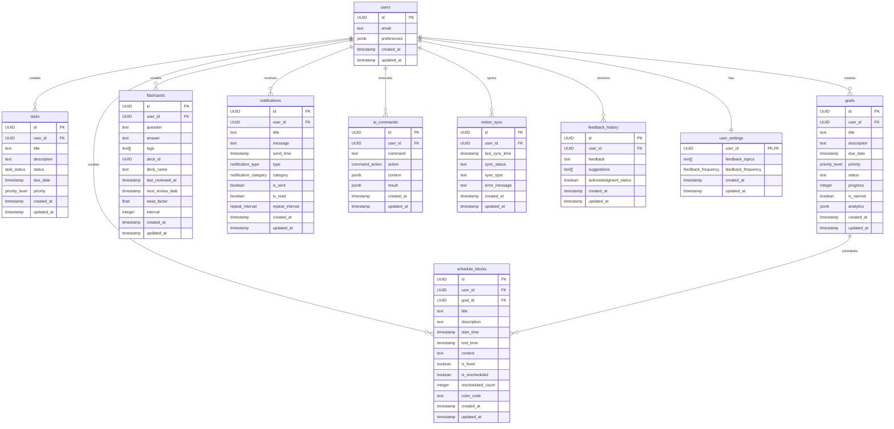

```mermaid
erDiagram
    users ||--o{ tasks : "creates"
    users ||--o{ goals : "creates"
    users ||--o{ schedule_blocks : "creates"
    users ||--o{ flashcards : "creates"
    users ||--o{ notifications : "receives"
    users ||--o{ ai_commands : "executes"
    users ||--o{ notion_sync : "syncs"
    users ||--o{ feedback_history : "receives"
    users ||--|| user_settings : "has"
    goals ||--o{ schedule_blocks : "schedules"

    users {
        UUID id PK
        text email
        jsonb preferences
        timestamp created_at
        timestamp updated_at
    }

    tasks {
        UUID id PK
        UUID user_id FK
        text title
        text description
        task_status status
        timestamp due_date
        priority_level priority
        timestamp created_at
        timestamp updated_at
    }

    goals {
        UUID id PK
        UUID user_id FK
        text title
        text description
        timestamp due_date
        priority_level priority
        text status
        integer progress
        boolean is_starred
        jsonb analytics
        timestamp created_at
        timestamp updated_at
    }

    schedule_blocks {
        UUID id PK
        UUID user_id FK
        UUID goal_id FK
        text title
        text description
        timestamp start_time
        timestamp end_time
        text context
        boolean is_fixed
        boolean is_rescheduled
        integer rescheduled_count
        text color_code
        timestamp created_at
        timestamp updated_at
    }

    flashcards {
        UUID id PK
        UUID user_id FK
        text question
        text answer
        text[] tags
        UUID deck_id
        text deck_name
        timestamp last_reviewed_at
        timestamp next_review_date
        float ease_factor
        integer interval
        timestamp created_at
        timestamp updated_at
    }

    notifications {
        UUID id PK
        UUID user_id FK
        text title
        text message
        timestamp send_time
        notification_type type
        notification_category category
        boolean is_sent
        boolean is_read
        repeat_interval repeat_interval
        timestamp created_at
        timestamp updated_at
    }

    user_settings {
        UUID user_id PK,FK
        text[] feedback_topics
        feedback_frequency feedback_frequency
        timestamp created_at
        timestamp updated_at
    }

    feedback_history {
        UUID id PK
        UUID user_id FK
        text feedback
        text[] suggestions
        boolean acknowledgment_status
        timestamp created_at
        timestamp updated_at
    }

    ai_commands {
        UUID id PK
        UUID user_id FK
        text command
        command_action action
        jsonb context
        jsonb result
        timestamp created_at
        timestamp updated_at
    }

    notion_sync {
        UUID id PK
        UUID user_id FK
        timestamp last_sync_time
        text sync_status
        text sync_type
        text error_message
        timestamp created_at
        timestamp updated_at
    }
``` 